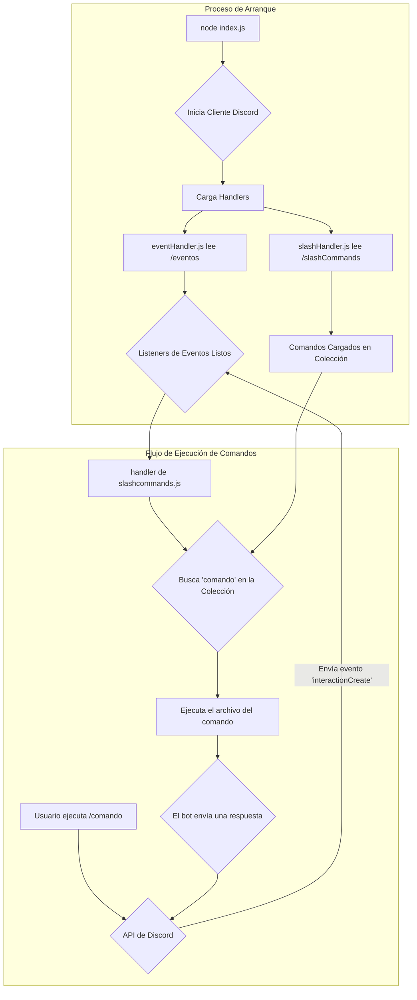

<div align="center">
  
</div>

---

# Anthocito Bot
- **Autor**: [AnthoFu 🦊](https://github.com/AnthoFu)

Este repositorio contiene todo el código y las funciones de **Anthocito**. Es un proyecto personal a largo plazo con el objetivo de crear un bot útil y divertido para Discord.

---

## ✨ Características

Anthocito está diseñado para ser un bot multifuncional. Algunas de las características planeadas y en desarrollo son:

*   **🔨 Moderación:** Comandos para mantener tu servidor ordenado.
*   **🎲 Minijuegos:** Juegos interactivos para pasar el rato.
*   **⚙️ Útiles:** Herramientas y comandos de utilidad general.
*   **🖼️ Imágenes:** Comandos para interactuar con imágenes.

---

## 📊 Diagrama de Flujo

Este diagrama muestra visualmente cómo se inicia el bot y cómo procesa un comando de un usuario.



---

## 📂 Estructura del Repositorio

El proyecto está organizado de forma modular para que sea fácil de mantener y escalar. Aquí te explico qué hace cada parte:

```
.
├── 📄 index.js
├── 📁 slashCommands/
│   ├── 📁 configuracion/
│   ├── 📁 minijuegos/
│   ├── 📁 moderacion/
│   └── 📁 utiles/
├── 📁 eventos/
│   ├── 📁 client/
│   └── 📁 interaction/
├── 📁 handlers/
│   ├── 📄 eventHandler.js
│   └── 📄 slashHandler.js
├── 📄 package.json
└── 📄 .gitignore
```

*   **`index.js`**: Es el corazón del bot. Se encarga de iniciar el cliente de Discord, iniciar sesión y llamar a los *handlers* para cargar todos los comandos y eventos.
*   **`slashCommands/`**: Aquí viven todos los comandos de barra diagonal (slash commands) del bot. Están organizados en subcarpetas por categorías (moderación, minijuegos, etc.) para mantener el orden.
*   **`eventos/`**: Contiene los archivos que manejan los eventos de Discord, como cuando el bot se conecta (`status.js`) o cuando un usuario interactúa con un comando (`slashcommands.js`).
*   **`handlers/`**: Son los manejadores que leen dinámicamente los archivos de los directorios `slashCommands` y `eventos`.
    *   `slashHandler.js`: Lee todos los archivos de comandos y los registra en la API de Discord.
    *   `eventHandler.js`: Lee todos los archivos de eventos y crea los *listeners* correspondientes en el cliente.
*   **`package.json`**: Define la información del proyecto y las dependencias necesarias, como `discord.js`.

---

## 🚀 Cómo Empezar

Si quieres ejecutar tu propia instancia de Anthocito, sigue estos pasos:

1.  **Clona el repositorio:**
    ```bash
    git clone https://github.com/anthofu/anthocito.git
    ```

2.  **Instala las dependencias:**
    Navega a la carpeta del proyecto y ejecuta:
    ```bash
    npm install
    ```

3.  **Configura tus variables de entorno:**
    Crea un archivo llamado `.env` en la raíz del proyecto y añade el token de tu bot:
    ```
    TOKEN=TU_TOKEN_DE_DISCORD_AQUI
    ```

4.  **Inicia el bot:**
    ```bash
    node index.js
    ```

¡Y listo! El bot debería estar en línea y funcionando.