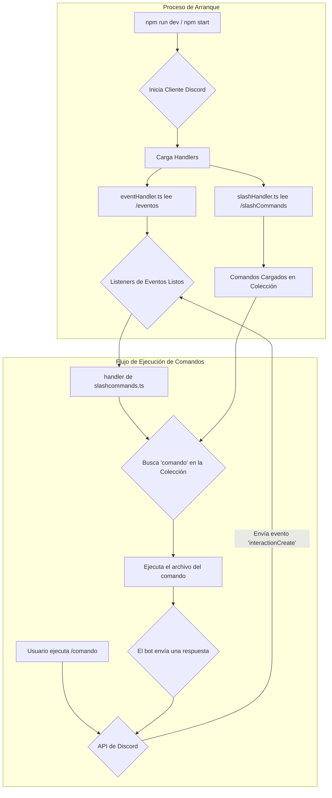

<div align="center">
  
</div>

---

# Anthocito Bot

- **Autor**: [AnthoFu 🦊](https://github.com/AnthoFu)

Este repositorio contiene todo el código y las funciones de **Anthocito**. Es un proyecto personal basado en **TypeScript** con el objetivo de crear un bot útil y divertido para Discord.

---

## ✨ Características

Anthocito está diseñado para ser un bot multifuncional. Algunas de las características planeadas y en desarrollo son:

- **🔨 Moderación:** Comandos para mantener tu servidor ordenado.
- **🎲 Minijuegos:** Juegos interactivos para pasar el rato.
- **⚙️ Útiles:** Herramientas y comandos de utilidad general.
- **🖼️ Imágenes:** Comandos para interactuar con imágenes.

---

## 📊 Diagrama de Flujo

Este diagrama muestra visualmente cómo se inicia el bot y cómo procesa un comando de un usuario.


```mermaid
graph TD
    subgraph Proceso de Arranque
        A[npm run dev / npm start] --> B{Inicia Cliente Discord};
        B --> C[Carga Handlers];
        C --> D["eventHandler.ts lee /eventos"];
        C --> E["slashHandler.ts lee /slashCommands"];
        D --> F{Listeners de Eventos Listos};
        E --> G[Comandos Cargados en Colección];
    end

    subgraph Flujo de Ejecución de Comandos
        H[Usuario ejecuta /comando] --> I{API de Discord};
        I -- Envía evento 'interactionCreate' --> F;
        F --> J["handler de slashcommands.ts"];
        J --> K{Busca 'comando' en la Colección};
        K --> L[Ejecuta el archivo del comando];
        L --> M{El bot envía una respuesta};
        M --> I;
    end

    G --> K;
```

---

## 📂 Estructura del Repositorio

El proyecto está organizado de forma modular utilizando TypeScript:

```
.
├── 📄 index.ts                 # Punto de entrada principal
├── 📁 slashCommands/          # Comandos de barra diagonal
│   ├── 📁 configuracion/
│   ├── 📁 minijuegos/
│   ├── 📁 moderacion/
│   └── 📁 utiles/
├── 📁 eventos/                # Manejadores de eventos de Discord
│   ├── 📁 client/
│   ├── 📁 guild/
│   └── 📁 interaction/
├── 📁 handlers/               # Cargadores dinámicos de comandos y eventos
│   ├── 📄 eventHandler.ts
│   ├── 📄 slashHandler.ts
│   └── 📄 databaseHandler.ts
├── 📁 models/                 # Esquemas de Mongoose para MongoDB
├── 📁 interfaces/             # Definiciones de tipos (TS)
├── 📄 package.json            # Scripts y dependencias
├── 📄 tsconfig.json           # Configuración de TypeScript
└── 📄 .env                    # Variables de entorno (Token, DB)
```

---

## 🚀 Cómo Empezar

### 1. Requisitos
- [Node.js](https://nodejs.org/) (v18 o superior)
- [MongoDB](https://www.mongodb.com/) (Instancia local o Atlas)

### 2. Instalación
```bash
git clone https://github.com/anthofu/anthocito.git
cd anthocito
npm install
```

### 3. Configuración
Crea un archivo `.env` en la raíz del proyecto:
```env
TOKEN=TU_TOKEN_DE_DISCORD_AQUI
MONGODB_URI=TU_CONEXION_A_MONGODB
PORT=3000
```

### 4. Ejecución
Para desarrollo (con recarga automática mediante `ts-node`):
```bash
npm run dev
```

Para producción (compilar y ejecutar):
```bash
npm run build
npm start
```

---

## ☁️ Despliegue (Render)

Si estás desplegando en [Render](https://render.com), asegúrate de usar la siguiente configuración:

- **Build Command:** `npm install && npm run build`
- **Start Command:** `npm start`
- **Environment Variables:** Asegúrate de añadir `TOKEN`, `MONGODB_URI` y `PORT` en el panel de Render.

> **Nota:** El proyecto ha sido migrado de JavaScript a TypeScript. Si recibes errores de "module not found", asegúrate de haber ejecutado el comando `build` y que el bot esté iniciando desde la carpeta `dist/`.
